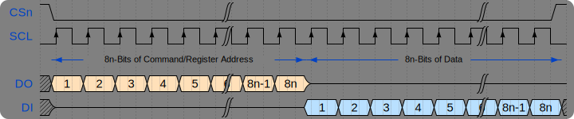

## 2. Execute Code from Flash 
In the last chapter, you learned the boot-up process of RP2040 &micro;C. In summary, the process is relatively simple, the bootrom verifies that the first 256 Bytes in Flash is valid, loads it into RAM and start executing it. But, the RP2040 can work with any Flash chip that can communicate over SPI protocol and is smaller than 16 MBytes in size. The development board used in these tutorials (Pi Pico) has 2 MBytes of Flash. It also means that it should be able to execute a program that is larger than 256 Bytes.

RP2040 contains XIP (Execute-In-Place) peripheral to allow processor to fetch instructions directly from Flash. The idea is simple, convert the read accesses requests from the processor into SPI commands. Thus, XIP acts as a Bus-To-SPI translation layer between the RP2040's processor and a Flash that can communicate over SPI. The goal of this chapter is to setup XIP such that the code can be executed directly from Flash. In fact, the 256 Bytes code that is loaded to RAM by bootrom and executed, is technically supposed to configure XIP, this is by design.

### SPI Protocol
Let's first brush-up on Serial Peripheral Interface (SPI) before discussing its variants Double-SPI and Quad-SPI.

SPI was originally developed by Motorola in 1980s. It is used heavily in today's time for communication between two &micro;Cs, a &micro;C and sensor/s or actuator/s. There are may flavors of SPI as well, like Microwire (developed by National Semiconductor) and Synchronous Serial Protocol (developed by Texas Instruments). Motorola's version of SPI is discussed here.

Following image shows the connections between a &micro;C and a sensor that can communicate through SPI protocol.

The important pin names are,
1. `CSn` - Active low chip-select or slave-select, AKA: `CS`, `/SS`, <code>CS</code>, `SSn`.
2. `SCK` - Clock signal, AKA: `CLK`, `SCLK`
3. `TX` - Data Transmit Line, AKA: `SDO`, `DO`, `MOSI` (Master-Out-Slave-In on &micro;C side), `MISO` (Master-In-Slave-Out on sensor side)
4. `RX` - Data Receive Line, AKA: `SDI`, `DI`, `MOSI` (Master-Out-Slave-In on sensor side), `MISO` (Master-In-Slave-Out on &micro;C side)

There are four modes over which SPI can work. These modes are just combinations of clock polarity (idle state low or high) and clock phase (data sample on rising or falling edge). The discussion here assumes mode 0, which corresponds to idle clock state being logic low and data being sampled on the rising edge of the clock.

Following diagram shows a common data write message.

Following diagram shows a common data read message.

You might have achieved something similar to what is shown in the diagrams above if you have worked with a sensor before that communicates over SPI protocol. Our goal here is to use faster variants of SPI protocol so that the processor can fetch the instructions from the Flash chip available onboard. Following reading material about XIP, SSI and Flash will be helpful in upcoming sections.
- [RP2040 Datasheet, Section 4.10 SSI](https://datasheets.raspberrypi.com/rp2040/rp2040-datasheet.pdf#page=572)
- [W25Q80DV Flash Datasheet, Chapters 6-8](https://www.winbond.com/resource-files/w25q80dv%20dl_revh_10022015.pdf#page=11)

### Let's Start Slow
