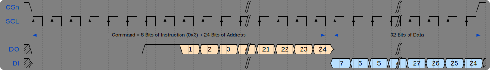

## 2. Execute Code from Flash 
In the last chapter, you learned the boot-up process of RP2040 &micro;C. In summary, the process is relatively simple, the bootrom verifies that the first 256 Bytes in Flash is valid, loads it into RAM and start executing it. But, the RP2040 can work with any Flash chip that can communicate over SPI protocol and is smaller than 16 MBytes in size. The development board used in these tutorials (Pi Pico) has 2 MBytes of Flash. It also means that it should be able to execute a program that is larger than 256 Bytes.

RP2040 contains XIP (Execute-In-Place) peripheral to allow processor to fetch instructions directly from Flash. The idea is simple, convert the read accesses requests from the processor into SPI commands. Thus, XIP acts as a Bus-To-SPI translation layer between the RP2040's processor and a Flash that can communicate over SPI. The goal of this chapter is to setup XIP such that the code can be executed directly from Flash. In fact, the 256 Bytes code that is loaded to RAM by bootrom and executed, is technically supposed to configure XIP, this is by design.

### SPI Protocol
Let's first brush-up on Serial Peripheral Interface (SPI) before discussing its variants Double-SPI and Quad-SPI.

SPI was originally developed by Motorola in 1980s. It is used heavily in today's time for communication between two &micro;Cs, a &micro;C and sensor/s or actuator/s. There are may flavors of SPI as well, like Microwire (developed by National Semiconductor) and Synchronous Serial Protocol (developed by Texas Instruments). Motorola's version of SPI is discussed here.

Following image shows the connections between a &micro;C and a sensor that can communicate through SPI protocol.


The important pin names are,
1. `CSn` - Active low chip-select or slave-select, AKA: `CS`, `/SS`, <code><span style="text-decoration:overline">CS</span></code>, `SSn`.
2. `SCK` - Clock signal, AKA: `CLK`, `SCLK`
3. `TX` - Data Transmit Line, AKA: `SDO`, `DO`, `MOSI` (Master-Out-Slave-In on &micro;C side), `MISO` (Master-In-Slave-Out on sensor side)
4. `RX` - Data Receive Line, AKA: `SDI`, `DI`, `MOSI` (Master-Out-Slave-In on sensor side), `MISO` (Master-In-Slave-Out on &micro;C side)

There are four modes over which SPI can work. These modes are just combinations of clock polarity (idle state low or high) and clock phase (data sample on rising or falling edge). The discussion here assumes mode 0, which corresponds to idle clock state being logic low and data being sampled on the rising edge of the clock.

Following diagram shows a common data write message.


Following diagram shows a common data read message.


You might have achieved something similar to what is shown in the diagrams above if you have worked with a sensor before that communicates over SPI protocol. Our goal here is to use faster variants of SPI protocol so that the processor can fetch the instructions from the Flash chip available onboard. Following reading material about XIP, SSI and Flash will be helpful in upcoming sections.
- [RP2040 Datasheet, Section 4.10 SSI](https://datasheets.raspberrypi.com/rp2040/rp2040-datasheet.pdf#page=572)
- [W25Q80DV Flash Datasheet, Chapters 6-8](https://www.winbond.com/resource-files/w25q80dv%20dl_revh_10022015.pdf#page=11)

### Let's Start Slow
Reading the Flash datasheet, you'll very quickly learn, in Chapter 6, that it can work with three variants of SPI; Standard SPI, Dual SPI and Quad SPI; in modes 0 and 3. Let's stick to Standard SPI in mode 0 for now. It also contains registers like `CONTROL` and `STATUS` that would require special attention. With the goal of reading the instructions from Flash in mind, you'd soon realize that you just have to make the &micro;C spit out the [*Read Data* (`0x3`)](https://www.winbond.com/resource-files/w25q80dv%20dl_revh_10022015.pdf#page=26) instruction along with the appropriate address and you'd receive the program instructions stored in the Flash back. Following diagram shows the SPI message associated with such an interaction.


Unfortunately, the discussion in RP2040's Datasheet is not that easy to follow. Regardless, on the &micro;C's side, you'd notice that almost every important aspect of this communication is handled by three registers,
1. [Control Register 0 (`CTRLR0`)](https://datasheets.raspberrypi.com/rp2040/rp2040-datasheet.pdf#page=603)
2. [Baud rate (`BAUDR`)](https://datasheets.raspberrypi.com/rp2040/rp2040-datasheet.pdf#page=604)
3. [SPI control (`SPI_CTRLR0`)](https://datasheets.raspberrypi.com/rp2040/rp2040-datasheet.pdf#page=609)

The discussion of `BAUDR`'s value is provided in [Section 4.10.4 of RP2040 Datasheet](https://datasheets.raspberrypi.com/rp2040/rp2040-datasheet.pdf#page=575). It mentions that the frequency of the SPI CLK signal is the function of $`f_{ssi\_clk}`$ and the 16-bit value (`SCKDV`) in `BAUDR` register. Also note that only an even value in range (0, 65534] is allowed. Thus, the `BAUDR` register's value can be figured out if the desired SPI CLK frequency is known. This information is available in [Section 9.6 of Flash Datasheet](https://www.winbond.com/resource-files/w25q80dv%20dl_revh_10022015.pdf#page=59). It states that the maximum SPI clock frequency is 33 MHz for Read Data Instruction (0x3). Thus, the `SCKDV` value in `BAUDR` register is,
```math
\texttt{SCKDV} = \frac{f_{ssi\_clk}}{f_{sclk\_out}} = \frac{125 MHz}{33 MHz} = 3.7878 \approx 4 \qquad \because f_{ssi\_clk} = f_{clk\_sys}
```

Let's look at different bits of `CTRLR0` and figure out what should go in each,
- `DFS` - In [Section 4.10.6 of RP2040 Datasheet](https://datasheets.raspberrypi.com/rp2040/rp2040-datasheet.pdf#page=576) that the `DFS` (`CTRLR0[3:0]`) is invalid and writing to it has no effect. So, it is left unchanged. 
- `FRF` - On [pg. 593 of RP2040 Datasheet](https://datasheets.raspberrypi.com/rp2040/rp2040-datasheet.pdf#page=593) it is mentioned that `CTRLR0.SPI_FRF` is only applicable if `FRF` is programmed to `0b00`. So, it is left unchanged.
- `SCPH` and `SCPOL` - These two bits specify the SPI mode. As mentioned previously, the discussion here assumes mode 0. Thus, both the bits are left unchanged. Further discussion on this is available in [Section 4.10.10.1 of RP2040 Datasheet](https://datasheets.raspberrypi.com/rp2040/rp2040-datasheet.pdf#page=584).
- `TMOD` - These bits are set to `0x3`, EEPROM read mode (TX then RX; RX starts after control data TX'd), since for every transaction a command (instruction + address) is transmitted and the data is received right after.
- `SLV_OE` - Left unchanged since the &micro;C is supposed to act as a master in this case.
- `SRL` - Left unchanged since enough information about this bit is not available.
- `CFS` - Left unchanged since these bits correspond to Microwire flavor of SPI protocol, which is not being used here.
- `DFS_32` - Set to 31 since the data from Flash is expected to be 32-bits in size.
- `SPI_FRF` - Left unchanged, to `0x0`, since the communication is supposed to happen in Standard SPI format, not in Dual SPI or Quad SPI format.
- `SSTE` - Enabling this will make the `CSn` to go high at the end of a message. The Flash used here doesn't mandate this, so it is left unchanged, to `0x0`.

Let's look at the XIP related configuration in `SPI_CTRLR0`,
- `TRANS_TYPE` - Allows the choice of different parts of the message (instruction, address or data) to be sent in format specified by `SPI_FRF` in `CTRLR0`. Since current discussion relates to Standard SPI format, this field is left to `0x0.`
- `ADDR_L` - The addresses in Flash are 24-bits in size. Note that the field description in the datasheet mentions that the value should be in 4-bit increments. Thus, this field is set to `24 / 4 = 6`.
- `INST_L` - All the instructions of Flash chip used here are 8-bits long. So, this field is set to `0x2`.
- `WAIT_CYCLES` - Left unchanged here. Makes SSI to add dummy SCLK cycles between command and data. Can be useful for Flash instructions similar to Fast Read (`0xB`).
- `SPI_DDR_EN` - Left unchanged since SPI is not operating in DDR mode.
- `INST_DDR_EN` - Left unchanged since SPI is not operating in DDR mode.
- `SPI_RXDS_EN` - Left unchanged since enough information about this bit is not available.
- `XIP_CMD` - Set to `0x3` (Read Data Instruction) because this needs to be appended before 24-bit address as shown in the diagram [above](#lets-start-slow).

### Convert Into a Program
To put everything discussed so far into a working firmware, let's first copy the content of last tutorial into a new directory and make the following changes.
1. Rename `boot2Blinky.c` to `flashBlinky.c`.
2. Replace `__attribute__((section(".boot2"))) void bootStage2(void)` with `int main(void)` in `flashBlinky.c`.
3. Move `compCrc32.cpp` into a sub-folder called `boot2`.
4. Create a new file called `bootStage2.c` in `boot2` sub-folder.

The complete process can now be described as follows,
1. bootrom checks whether first 256 Bytes (which contains `bootStage2` function) of Flash is valid or not.
2. If it is then it loads those 256 Bytes into RAM and executes it.
3. The `bootStage2` function sets up XIP peripheral, to allow processor to fetch instructions directly from Flash, and then jumps to the `main` function.

Consider the following C code, which would go in the new `bootStage2.c` file.
```C {.numberLines}
#include <stdint.h>
#include <stdbool.h>

// Define necessary register addresses
// XIP
#define XIP_BASE                    (0x10000000)
// SSI
#define SSI_BASE                    (0x18000000)
#define SSI_CTRLR0                  (*(uint32_t *) (SSI_BASE + 0x000))
#define SSI_SSIENR                  (*(uint32_t *) (SSI_BASE + 0x008))
#define SSI_BAUDR                   (*(uint32_t *) (SSI_BASE + 0x014))
#define SSI_SPI_CTRLR0              (*(uint32_t *) (SSI_BASE + 0x0f4))

// A brief list of steps to take
// 1. Setup IO_QSPI pins for XIP
// 2. Setup SSI interface
// 3. Enable XIP Cache

// Boot stage 2 entry point
__attribute__((section(".boot2"))) void bootStage2(void)
{
    // 1. Setup IO_QSPI pins for XIP (already done by bootrom)
    //  - Bring IO_QSPI out of reset state
    //  - Set SCLK and SS to OE
    //  - Set all IO_QSPI GPIOs function to XIP

    // 2. Setup SSI interface
    SSI_SSIENR &= ~(1 << 0); // Disable SSI to configure it
    SSI_BAUDR = 4; // Set clock divider to 4
    SSI_CTRLR0 |= (3 << 8) | (31 << 16); // Set EEPROM mode and 32 clocks per data frame
    SSI_SPI_CTRLR0 |= (6 << 2) | (2 << 8) | (0x03 << 24); // Set address length to 24-bits, instruction length to 8-bits and command to Read Data (03h)
    SSI_SSIENR |= 1 << 0; // Enable SSI

    // 3. Enable XIP Cache
    // It is enabled by default. Take a look at https://datasheets.raspberrypi.com/rp2040/rp2040-datasheet.pdf#page=128

    void (*main)(void) = (void (*)())0x10000101; // Note 0x10000100 + 0x1 (this forces the instructions to be interpreted as thumb)
    main();

    // Just to be safe if we come back here
    while(true);
}
```
Note that Section 2 of the code above first disables SSI peripheral, changes register values to what was discussed in [previous section](#lets-start-slow) and enables SSI peripheral. This concludes the setup of XIP peripheral. Now the processor should be able to fetch instructions directly from Flash.

Section 3 of the code above is calling the `main` function defined in `flashBlinky.c` file. To do this, the address of `main` function (`0x10000101`) is converted into a function pointer (`(void (*)())`) and then the `main` function is actually called. The address of the `main` function is known precisely to be `0x10000100` since it will be placed right after the `.crc` section, with the help of the Linker Script. The difference of `0x1` in the address tells the processor to interpret the instructions as [Thumb and not Arm](https://stackoverflow.com/questions/28669905/what-is-the-difference-between-the-arm-thumb-and-thumb-2-instruction-encodings).

Make following changes to the linker script to put `main` function right after `.crc` section in the binary.
```ld {.numberLines}
ENTRY(bootStage2);

MEMORY
{
    flash(rx) : ORIGIN = 0x10000000, LENGTH = 2048k
    sram(rwx) : ORIGIN = 0x20000000, LENGTH = 256k
}

SECTIONS
{
    .boot2 :                        /* Changed */
    {
        *(.boot2*)
        . = ORIGIN(flash) + 252;
        *(.crc*)
    } > flash

    .text :                         /* Added */
    {                               /* Added */
        *(.text*)                   /* Added */
    } > flash                       /* Added */
}
```
The only major change here compared to last tutorial is that the first 256 Bytes (`.boot2` and `.crc` sections) are now placed in a separate `.boot2` section.

Significant changes are done in the `Makefile`. So, take a look at its content and make sure you understand what commands the `Makefile` is executing.

Now you should be able to generate a `*.uf2` file, upload it on the &micro;C and see the LED flashing, which is handled by the `main` function that was never loaded into RAM.
