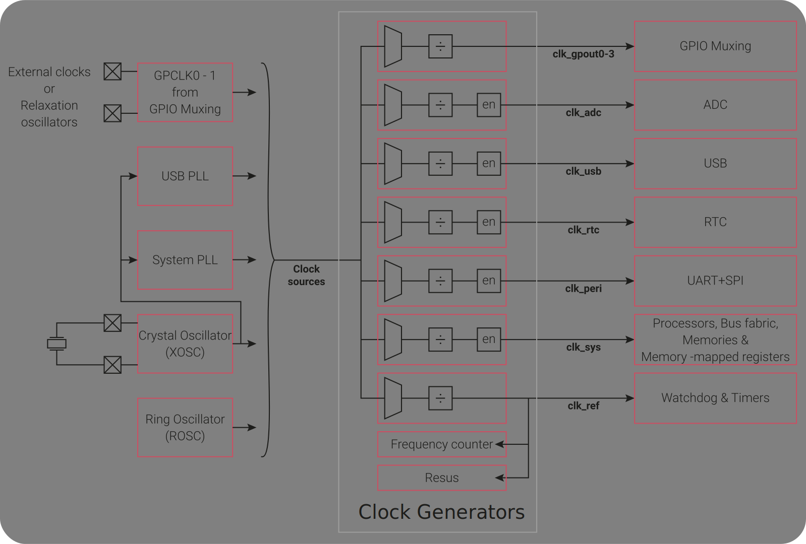
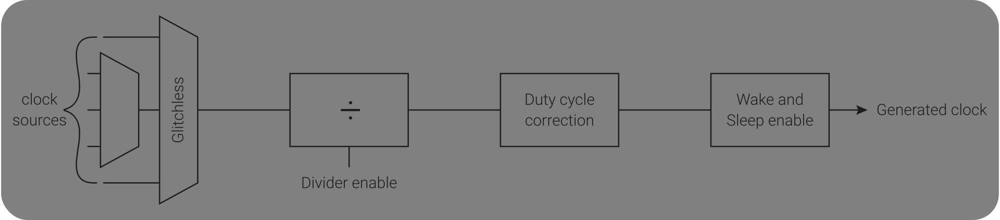
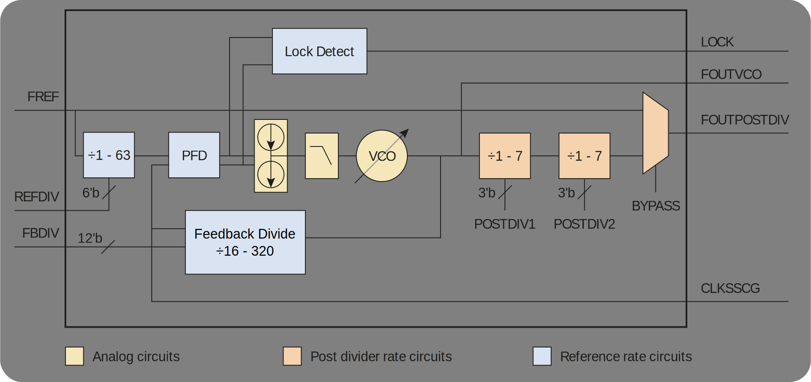

## 4. Job of the `resetHandler`
It was mentioned in the last tutorial that the `resetHandler` has to perform certain tasks before the `main` function is called. The tasks that a `resetHandler` typically performs are as follows,
1. Copy the initialized global variables, `.data` section, into the `sram`.
2. Zero out the uninitialized variables, `.bss` section, in the `sram`.
3. Setup all the clocks and PLLs.
4. Call C/C++ runtime startup code.
5. Jump to `main`

This list of tasks is not exclusive and can change based on the requirement. Let's try to implement the code for each of these tasks with the least effort possible.

### Setup all the clocks and PLLs
Setting up clocks is very important since they control pretty-much everything on a &micro;C. You might have wondered what the term 'Clock Speed' even means when it was first used in Tutorial 1. Although the quantity like **133MHz** (max clock speed RP2040 can safely run at) sounds very familiar, since it is used to loosely reflect the processing power, not everyone understands its true meaning and its relation to the 'Clock Speed'.

Understand that the &micro;Cs are digital devices, and they operate on binary information. Thus, any signal inside a &micro;C can only be in either of the two states, i.e. on or off, while being measured. However, the signal can have any value in between while switching from one state to the other. This requires the signal measurement to be done only when the signal is stabilized in either of the two states. A Clock is used to sync all the functional blocks on a &micro;C to perform this signal measurement operation at the same time, or to accurately time the execution of any operation in general.

A clock is nothing but an accurate sinusoidal signal generated by oscillators or PLLs. This sinusoidal voltage signal is used by a &micro;C to sync all of its functional blocks/peripherals. Thus, if this sinusoidal signal stops for some reason then the &micro;C will also stop working even if they are being supplied with electric power. Moreover, since an operation happens inside a &micro;C per one cycle of the clock signal, higher the clock frequency/speed roughly means higher the computational performance.

RP2040 contains a [Clocks Block](https://datasheets.raspberrypi.com/rp2040/rp2040-datasheet.pdf#page=179) that manages different clock sources, PLLs and routing of clock signals. You should read following sections from the RP2040 datasheet before moving forward,
1. [Section 2.15, Clocks](https://datasheets.raspberrypi.com/rp2040/rp2040-datasheet.pdf#page=179)
2. [Section 2.16, Crystal Oscillator (XOSC)](https://datasheets.raspberrypi.com/rp2040/rp2040-datasheet.pdf#page=216)
3. [Section 2.17, Ring Oscillator (ROSC)](https://datasheets.raspberrypi.com/rp2040/rp2040-datasheet.pdf#page=221)
4. [Section 2.18, Phase-Locked Loop (PLL)](https://datasheets.raspberrypi.com/rp2040/rp2040-datasheet.pdf#page=228)
<!-- 5. [Section 4.6, Timer](https://datasheets.raspberrypi.com/rp2040/rp2040-datasheet.pdf#page=534) -->

Here is the short summary of the discussion provided in the sections above. Different parts of RP2040 has the ability to run from total of five different clock sources as shown on the left side of image below, On-Chip [Ring Oscillator](https://en.wikipedia.org/wiki/Ring_oscillator) (ROSC), External [Crystal Oscillator](https://en.wikipedia.org/wiki/Crystal_oscillator) (XOSC) as direct source and through [Phase-Locked Loops (PLLs)](https://en.wikipedia.org/wiki/Phase-locked_loop), Direct Input through GPIOs and through [Relaxation Oscillators](https://en.wikipedia.org/wiki/Relaxation_oscillator).



By default, the RP2040 boots up with the clock signal from the ROSC, which is part of the &micro;C and nominally runs at 6.5MHz. However, this frequency can change due to the working conditions like process, voltage and temperature. All in all, ROSC is not an accurate clock source, but it is an efficient one. So, if the goal is to run the &micro;C at super low power (in sleep or dormant mode) then ROSC is a good choice as the clock source.

Crystal Oscillators are made of quartz crystals and generally require a couple of extra components to work. However, crystal oscillators are extremely accurate clock sources. RP2040 supports crystal oscillators that produce frequencies anywhere from 1MHz - 15MHz. Majority of the development boards designed around RP2040 contain a 12MHz XOSC. This highly accurate clock source can also be fed to PLLs present in RP2040 (System PLL and USB PLL), to produce accurate clocks with frequencies that are significantly higher than the crystal frequency.

There are six GPIOs on RP2040 than can accept or output a clock signal. This way, if a reliable and high-frequency clock source is already available on a development board, then the precious board area can be saved by not adding an XOSC. The GPIOs can also be used in conjunction with some passive components to create a [Relaxation Oscillator](https://datasheets.raspberrypi.com/rp2040/rp2040-datasheet.pdf#page=182). These methods will not be discussed further since the board being used throughout all the tutorials already have XOSC.

A combination of these clock sources is provided to each clock generator. A clock generator in RP2040 contain clock source multiplexer(mux)s, a divider, a duty-cycle correction block and a clock enable block as shown in the figure below.



The components inside a clock generator perform following functions,
- **Clock Source Multiplexers:** Each clock generator contains at least an auxiliary (aux) multiplexer (mux) which may glitch while switching the clock source. However, the clock generators for `clk_sys` and `clk_ref` also contain glitch-less mux since these clocks perform a vital role of running the processors and timers of RP2040.
- **Clock Divider:** The divider is capable of producing a clock signal with a frequency equal to source frequency divided by 1 or 2.0 &ndash; 16777215.99. Basically, it is capable of producing a clock that has equal or lower frequency than the source frequency.
- **Duty-Cycle Correction Block:** An Issue with the clock divider discussed above is that it may produce uneven waveform when the divisor is an odd number. This block corrects the uneven waveform and produces a waveform with 50% duty-cycle.
- **Clock Enable Block:** This block controls whether a clock signal is passed to a region/peripheral of the &micro;C based on the `WAKE_EN` and `SLEEP_EN` register values. This is meant to be used with different power saving modes and will be part of discussion for another tutorial.

The goal of this section is to set up XOSC and PLLs to run the system at the desired clock frequency. So, let's quickly discuss how the PLLs work before moving forward. Following figure shows a simplified version of the PLLs present in RP2040.



The `FREF` input to the PLL circuit shown below is the accurate lower frequency clock, coming from 12MHz XOSC in our case. The PLL block contains voltage controlled oscillator (VCO) that can produce high frequency clock (`FOUTVCO`) proportional to the voltage applied to it. The output from VCO is fed to a phase-frequency detector (PFD) through a feedback divider. The idea here is that the PFD would try to change the voltage provided to VCO such that the `FREF` divided by `REFDIV` and output of VCO divided by `FBDIV` end up having same frequency and zero phase. Thus, if `FBDIV` is set to 100, `REFDIV` is set to 1 and `FREF` is 12MHz, then the output of VCO will end up being 1200MHz when the PLL is locked. Since the processor of the &micro;C cannot function properly at such high frequencies, some post dividers, `POSTDIV1` and `POSTDIV2`, are provided to bring the frequency further down. Thus, the equation for final output clock frequency is,
```math
\texttt{FOUTPOSTDIV} = \frac{\texttt{FREF}}{\texttt{REFDIV}} \times \frac{\texttt{FBDIV}}{\texttt{POSTDIV1} \times \texttt{POSTDIV2}}
```
Following are some limitations imposed on the variables in the equations above,
- Minimum reference frequency (`FREF / REFDIV`) is 5MHz
- VCO output, `FOUTVCO`, must be in the range 750MHz &ndash; 1600MHz
- Feedback divider value (`FBDIV`) must be in the range 16 &ndash; 320
- Post dividers, `POSTDIV1` and `POSTDIV2`, must be in the range 1 &ndash; 7

As an example, let's try to come up with numbers that would achieve $\texttt{FOUTPOSTDIV} = 100\texttt{MHz}$. 

```math
\begin{equation}
    \left.
        \begin{array}{cc}
            \texttt{FREF} = 12\texttt{MHz} \\
            \texttt{REFDIV} = 1 \\
            750\texttt{MHz} \leq \texttt{FOUTVCO} \leq 1600\texttt{MHz}
    	\end{array}
    \right\}
    \implies 63\texttt{MHz} \leq \texttt{FBDIV} \leq 133\texttt{MHz}
\end{equation}
```
Thus, choosing a safe value of 100 for `FBDIV` yields
```math
\texttt{FOUTPOSTDIV} = \frac{12\texttt{MHz} \times 100}{\texttt{POSTDIV1} \times \texttt{POSTDIV2}}
```
Choosing valid values for `POSTDIV1` and `POSTDIV2` such that $\texttt{POSTDIV1} \times \texttt{POSTDIV2} = 12$ will achieve $\texttt{FOUTPOSTDIV} = 100\texttt{MHz}$. Since the [datasheet advises](https://datasheets.raspberrypi.com/rp2040/rp2040-datasheet.pdf#page=229) that `POSTDIV1` should be kept higher whenever possible, the values of the post dividers can be 6 and 2 respectively.

Now that the math has been figured out, the code to set up XOSC and PLLs can be written. Start with the code of previous tutorial and add `system_rp2040.cpp`. Following are the important definitions to be added in the file
```c++
#include <stdint.h>

// Define constants related to clocks
#define XOSC            (12000000)  // Crystal Oscillator Frequency

// Define necessary register addresses
// RESETS
#define RESETS_BASE                 (0x4000c000)
#define RESETS_RESET                (*(volatile uint32_t *) (RESETS_BASE + 0x000))
#define RESETS_RESET_DONE           (*(volatile uint32_t *) (RESETS_BASE + 0x008))
// XOSC
#define XOSC_BASE                   (0x40024000)
#define XOSC_CTRL                   (*(volatile uint32_t *) (XOSC_BASE + 0x000))
#define XOSC_STATUS                 (*(volatile uint32_t *) (XOSC_BASE + 0x004))
// PLL_SYS
#define PLL_SYS_BASE                (0x40028000)
#define PLL_SYS_CS                  (*(volatile uint32_t *) (PLL_SYS_BASE + 0x000))
#define PLL_SYS_PWR                 (*(volatile uint32_t *) (PLL_SYS_BASE + 0x004))
#define PLL_SYS_FBDIV_INT           (*(volatile uint32_t *) (PLL_SYS_BASE + 0x008))
#define PLL_SYS_PRIM                (*(volatile uint32_t *) (PLL_SYS_BASE + 0x00c))
// Clocks
#define CLOCKS_BASE                 (0x40008000)
#define CLOCKS_SYS_CTRL             (*(volatile uint32_t *) (CLOCKS_BASE + 0x03c))
#define CLOCKS_SYS_SELECTED         (*(volatile uint32_t *) (CLOCKS_BASE + 0x044))
// ROSC
#define ROSC_BASE                   (0x40060000)
#define ROSC_CTRL                   (*(volatile uint32_t *) (ROSC_BASE + 0x000))
```
> [!NOTE]
> The register definitions keep increasing as more and more features of the &micro;C are used. This issue will be addressed in the next tutorial where all the register accesses are converted into structure member accesses and this will be done for all the registers present in the &micro;C.

Let's add a function `void SystemInit()` that sets-up the clocks through following steps,
- Initialize XOSC and wait for the clock to stabilize. The determination of a stable clock is rather arbitrary. There is a `STARTUP_DELAY` register that defines how many clock cycles must be seen from the crystal before it can be declared stable. The default value of this register works in this case so it won't be changed. If you find that your development board doesn't work after this change then this register value might be increased to allow more XOSC stabilization time.
  ```c++
  // Initialize XOSC
  XOSC_CTRL |= (0xfab << 12); // Enable XOSC
  while (!(XOSC_STATUS & (1 << 31))); // Wait for XOSC to stabilize
  ```
- Initialize system PLL using the numbers discussed in previous paragraphs. The programming sequence for the PLLs recommended by the datasheet is as follows:
  1. Program the `REFDIV`.
  2. Program the `FBDIV`.
  3. Turn on the main power and VCO.
  4. Wait for the VCO to lock (i.e. keep its output frequency stable).
  5. Set up `POSTDIV1` and `POSTDIV2`, and turn them on.
  ```c++
  // Initialize System PLL
  RESETS_RESET &= ~(1 << 12); // Bring System PLL out of reset state
  while (!(RESETS_RESET_DONE & (1 << 12)));; // Wait for PLL peripheral to respond
  PLL_SYS_FBDIV_INT = 100; // Set feedback clock div = 100, thus VCO clock = 12MHz * 100 = 1.2GHz
  PLL_SYS_PWR &= ~((1 << 0) | (1 << 5)); // Turn on the main power and VCO
  while (!(PLL_SYS_CS & (1 << 31))); // Wait for PLL to lock
  PLL_SYS_PRIM = (6 << 16) | (2 << 12); // Set POSTDIV1 = 6 and POSTDIV2 = 2, thus 1.2GHz / 6 / 2 = 100MHz
  PLL_SYS_PWR &= ~(1 << 3); // Turn on the post dividers
  ```
- Set up the clock generator for `clk_sys`. This step mainly comprises switching the clock source muxes. It is advised by the datasheet that the aux mux should be programmed first before switching the glitch-less mux to aux mux. In this case, the aux mux defaults to correct source, so only the glitch-less mux is switched.
  ```c++
  // Setup clock generator
  // Setup clk_sys
  CLOCKS_SYS_CTRL |= (1 << 0); // Switch clk_sys glitch-less mux to CLKSRC_CLK_SYS_AUX and the aux defaults to CLKSRC_PLL_SYS
  while (!(CLOCKS_SYS_SELECTED & (1 << 1)));// Make sure that the switch happened
  ```
- Shut down the ROSC since it is not needed anymore.
  ```c++
  // Shut down ROSC
  ROSC_CTRL = (ROSC_CTRL & (~0x00fff000)) | (0xd1e << 12);
  ```
To see the effect of the code above, call the `SystemInit` function in `resetHandler` before calling `main` function as shown below.
```c++
...
void i2c0Irq            () __attribute__((weak, alias("defaultHandler")));
void i2c1Irq            () __attribute__((weak, alias("defaultHandler")));
void rtcIrq             () __attribute__((weak, alias("defaultHandler")));

// Declare SystemInit function
extern void SystemInit(void);

// Declare main function
extern int main(void);

...

void resetHandler()
{
    // Initialize the system
    SystemInit();

    main(); // Jump to main function
    while(true); // Inf loop if we ever come back here
}

...
```
If you run the compiled executable on the &micro;C now, you'd see that the LED is on at all times. Similar to what happened in previous tutorial, you'd see the LED blinking if you shake the &micro;C in front of you at a fast pace. Does this mean that the code somehow ended up in the `defaultHandler`? Not really, what really happened is that the LED blinking `for` loop in `main` is running at a much faster rate (100MHz / 6.5MHz &approx; 15 times faster). This hypothesis can be tested by increasing the number of `for` loops in `main` by 10 times. This time you'll clearly see the LED blinking, meaning that the code inside `main` is actually executing and not the one from `defaultHandler`. Now you can also set the value of `POSTDIV2` to 1, which will set `clk_sys` to 200MHz (not recommended by Raspberry Pi), and see the LED blinking at double the rate. Neat right!?

However, this behavior raises a question. If changing the clock frequency can affect the timing of a `for` loop (or any operation for that matter), then how can some events be accurately timed, which is the main advantage of a &micro;C over a &micro;P? There are many ways to deal with this problem inside a &micro;C, but an easier one is to make use of a timer/counter peripheral.

#### Timer
Let's take a short detour to understand how the [Timer](https://datasheets.raspberrypi.com/rp2040/rp2040-datasheet.pdf#page=534) peripheral of the RP2040 works and how it can be used to create an accurate `delay` or `sleep` function. The timer/counter in RP2040 is 64-bit wide which increments every &micro;s. So, it will overflow in &approx; 584942 years, meaning that it will practically never overflow. However, it needs a 1&micro;s reference signal to operate properly, which it gets from the [Watchdog](https://datasheets.raspberrypi.com/rp2040/rp2040-datasheet.pdf#page=544) peripheral.

The Watchdog peripheral runs on `clk_tick`, which is derived from `clk_ref`. Because `clk_ref` will be used for accurate timing, it is important that the most accurate clock source, XOSC, is used for it, and the RP2040 datasheet suggests the same [here](https://datasheets.raspberrypi.com/rp2040/rp2040-datasheet.pdf#page=544). So, let's set up the clock generator for `clk_ref` by adding following code to `SystemInit`,
```c++
...
#define PLL_SYS_PRIM                (*(volatile uint32_t *) (PLL_SYS_BASE + 0x00c))
// Clocks
#define CLOCKS_BASE                 (0x40008000)
#define CLOCKS_REF_CTRL             (*(volatile uint32_t *) (CLOCKS_BASE + 0x030))
#define CLOCKS_REF_SELECTED         (*(volatile uint32_t *) (CLOCKS_BASE + 0x038))
#define CLOCKS_SYS_CTRL             (*(volatile uint32_t *) (CLOCKS_BASE + 0x03c))
#define CLOCKS_SYS_SELECTED         (*(volatile uint32_t *) (CLOCKS_BASE + 0x044))
// ROSC
#define ROSC_BASE                   (0x40060000)
...
    PLL_SYS_PWR &= ~(1 << 3); // Turn on the post dividers

    // Setup clock generators
    // Setup clk_ref
    CLOCKS_REF_CTRL |= (2 << 0); // Switch clk_ref glitch-less mux to XOSC_CLKSRC for the best accuracy possible
    while (!(CLOCKS_REF_SELECTED & (1 << 2)));// Make sure that the switch happened
    // Setup clk_sys
    CLOCKS_SYS_CTRL |= (1 << 0); // Switch clk_sys glitch-less mux to CLKSRC_CLK_SYS_AUX and the aux defaults to CLKSRC_PLL_SYS
...
```
Now that `clk_ref` and as a result `clk_tick` are set up to have a 12MHz signal, it can be divided to generate a tick every 1&micro;s using the [`TICK`](https://datasheets.raspberrypi.com/rp2040/rp2040-datasheet.pdf#page=548) register of the Watchdog peripheral. The lower 9-bits of this register specify how many cycles of `clk_tick` need to pass for one tick to generate. Thus, setting this value to 12 makes a tick generated every 1&micro;s. Now, bringing the Timer peripheral out of reset will make it increment every 1&micro;s. Following lines of code configure the [`TICK`](https://datasheets.raspberrypi.com/rp2040/rp2040-datasheet.pdf#page=548) register,
```c++
...
#define ROSC_CTRL                   (*(volatile uint32_t *) (ROSC_BASE + 0x000))
// WATCHDOG
#define WATCHDOG_BASE               (0x40058000)
#define WATCHDOG_TICK               (*(volatile uint32_t *) (WATCHDOG_BASE + 0x02c))

void SystemInit()
{
    ...
    // Shut down ROSC
    ROSC_CTRL = (ROSC_CTRL & (~0x00fff000)) | (0xd1e << 12);

    // Enable 64-bit Timer
    WATCHDOG_TICK |= (12 << 0); // Set appropriate value for TICK, 1 us = 12 cycles / 12MHz
    RESETS_RESET &= ~(1 << 21); // Bring 64-bit Timer out of reset state
    while (!(RESETS_RESET_DONE & (1 << 21))); // Wait for TIMER peripheral to respond
}
```
The Timer/Counter value is split between two 32-bit registers, [`TIMEHR` and `TIMELR`](https://datasheets.raspberrypi.com/rp2040/rp2040-datasheet.pdf#page=541). Reading `TIMELR` latches the value of `TIMEHR` until it is read. Thus, for single core operation, it is advised to read `TIMELR` first and then `TIMEHR`. Making a `sleep` or `delay` function is now easy, measure the current time, add the desired wait time to it to get a time in the future, and keep reading the time until it is equal to or greater than the time in the future. Following lines of code achieve this,
```c++
...
#define WATCHDOG_TICK               (*(volatile uint32_t *) (WATCHDOG_BASE + 0x02c))
// TIMER
#define TIMER_BASE                  (0x40054000)
#define TIMER_TIMEHR                (*(volatile uint32_t *) (TIMER_BASE + 0x008))
#define TIMER_TIMELR                (*(volatile uint32_t *) (TIMER_BASE + 0x00c))

void SystemInit()
{
    ...
}

uint64_t readTime()
{
    uint32_t timeLR = TIMER_TIMELR;
    uint32_t timeHR = TIMER_TIMEHR;
    return (((uint64_t)timeHR << 32) | timeLR);
}

void usSleep(uint64_t us)
{
    uint64_t timeOld = readTime(); // Get current timer value
    while ((readTime() - timeOld) < us); // Wait till desired time is passed
}
```
The `main` and `defaultHandler` both can make use of `usSleep` function to blink the LED at the correct rate. Let's make the blinking in `main` function happen at 1Hz rate.
```c++
...
// Declare usSleep function
extern void usSleep(uint64_t us);

// Main entry point
int main(void)
{
    ...

    while (true)
    {
        usSleep(500000); // Wait for 0.5sec
        SIO_GPIO_OUT_XOR |= 1 << 25;  // Flip output for GPIO 25
    }
}
```
This concludes majority of the basics related to clocks and timing on a &micro;C. You can make a similar change to `defaultHandler` function. Now that the system is capable of running at your choice of frequency, let's tackle another task that `resetHandler` is supposed to perform.

### Copy the initialized global variables
Another task of `resetHandler` is to copy the `.data` section into the `sram`. As discussed in tutorial 1, `.data` section contains the values of the initialized global variables. Let's make the following changes to `flashBlinky.c`.
```C
...
extern void usSleep(uint64_t us);

// Global variable defining how many time LED should switch state
uint32_t blinkCnt = 21; // nBlink = (blinkCnt - 1) / 2

// Main entry point
int main(void)
{
    ...

    while (--blinkCnt)
    {
        usSleep(500000); // Wait for 0.5sec
        SIO_GPIO_OUT_XOR |= 1 << 25;  // Flip output for GPIO 25
    }
}
```
Note that the changed `main` function above is supposed to blink the LED 10 times and then exit. However, if you compile the code and run it on the &micro;C, you may see one of the following bizarre behavior
- LED keeps blinking indefinitely as if `blinkCnt` is not even there. (Expected behavior)
- LED blinks once and stays off for the rest of the time.
- LED stays on at all times.
- LED stays off at all times.

> [!NOTE]
> In reality, the first outcome listed above is expected, and you'd see it if optimization is disabled. However, with `-O3` applied, a detailed debugging session suggests that some kind of core register data corruption takes place that produces the other outcomes. If the code is stepped through at the assembly level then again everything works fine. All in all, the code currently is faulty anyway, so there is not much worth in investigating these outcomes further.

This issue is caused by the fact that the global variable `blinkCnt` is currently located in the Flash (look at the Object Dump) and XIP ignores all the write commands that it receives. Thus, `blinkCnt` is never actually decremented in `while (--blinkCnt)` and so the `while` loop never breaks.

> [!NOTE]  
> If you have been paying attention so far, you might be wondering how come no linker error is being generated for the global variable being used. For those of you not following this discussion, the global variables should end up in `.data` or `.bss` section. However, none of those sections are included in the linker script at the moment. So, technically, the global variable shouldn't exist in the final binary. Surprisingly, the linker works in a bit counterintuitive way in this case. Even though a section is not defined in the linker script, the linker tries to keep all the sections in the final binary unless the sections are explicitly placed in a special section called `/DISCARD/`. Thus, the global variable `blinkCnt` is actually present in the final binary, search for `blinkCnt` in the `.objdump` file.

Performing write operations to a specific address of a Flash memory is generally not permitted when it is in operation. SPI NOR Flash memories work at page and sector sizes. A sector is defined as the smallest erasable block size. Sectors can be subdivided into pages and the data can be written in page-size chunks. This is why all the write requests sent out by the processor are ignored by XIP.

This issue can be solved by moving all the global variables to the RAM and somehow making the code to have final RAM address (where the variables live during run-time) instead of the Flash address (where the variables are stored). You must be paying attention if you started thinking about VMA (virtual memory address) and LMA (load memory address).

To do this, you'll have to know where in the FLASH memory the global variables reside and where in the RAM they should be moved to. Then, in the `resetHandler`, the initialized global variable values can be moved to the RAM.

The location in the flash can be produced from the linker script, similar to what was done for the initial stack pointer (`_sstack`) in the previous tutorial. However, where the global variables go in the RAM is really your choice. One common RAM space allocation arrangement is shown below,
- Top of RAM
- Initial Stack Pointer
- Empty space available for both stack and heap
- ...
- Empty space available for both stack and heap
- Initial Heap Pointer
- Uninitialized (Initialized to 0) Global Variables
- Initialized Global Variables
- Bottom of RAM

Let's stick to this arrangement and try to deal with the placement of initialized global variables in the RAM. Consider the following changes made to the linker script.
```ld
...
    
    .text :
    {
        *(.vector*)
        *(.text*)
    } > flash

    .data :
    {
        *(.data*)
    } > sram AT > flash     /* "> sram" is the VMA, "> flash" is the LMA */

    .stack (NOLOAD) :
    {
        . = ORIGIN(sram) + LENGTH(sram);
        _sstack = .;
    } > sram

    /* Get LMA and VMA for .data section */
    _sdata = ADDR(.data);               /* Get starting LMA */
    _edata = _sdata + SIZEOF(.data);    /* Get ending LMA */
    _sdataf = LOADADDR(.data);          /* Get starting VMA */
}
```
Note that the linker script defines three symbols, `_sdata`, `_edata` and `_sdataf`, that can be used in `resetHandler` as shown below,
```c++
...
// Declare the initial stack pointer, the value will be provided by the linker
extern uint32_t _sstack, _sdata, _edata, _sdataf;
...
void resetHandler()
{
    // Copy .data section from FLASH to SRAM
    uint32_t *initValsPtr = &_sdataf;
    for (uint32_t *dataPtr = &_sdata; dataPtr < &_edata; ++dataPtr)
        *dataPtr = *initValsPtr++;
    
    // Initialize the system
    SystemInit();

    main(); // Jump to main function
    while(true); // Inf loop if we ever come back here
}
...
```
The `for` loop added above copies initial values of the global variables in RAM. However, if you compile the code now, you'd get the following error,
```
/usr/lib/gcc/arm-none-eabi/10.3.1/../../../arm-none-eabi/bin/ld: /tmp/ccHF0SOM.o: in function `resetHandler':
startup_rp2040.c:(.text+0x16): undefined reference to `memcpy'
collect2: error: ld returned 1 exit status
make: *** [Makefile:50: build/flashBlinky.elf] Error 1
```
This is because you might be compiling the code with `-O3`, in which case the compiler notices that the `for` loop is nothing but a memory copy option, and it should be optimized with the help of `memcpy` function. But, one of the linker flags added to the `Makefile` is `-nostdlib`, which means that `memcpy` is not defined anywhere. You can add `-fno-builtin` linker flag, which tells the compiler to not use the commonly available built-in functions, take a look at [Options Controlling C Dialect](https://gcc.gnu.org/onlinedocs/gcc/C-Dialect-Options.html) for further clarification. Now, you should be able to compile the executable, run it on the &micro;C and observe the LED blinking for 10 times only.